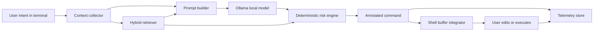

# shctrl

`shctrl` is a terminal-native local language model assistant for shell command generation with retrieval grounding and inline risk annotation.

It turns natural language into shell-ready commands, looks up relevant internal runbooks/playbooks when available, scores command risk deterministically, and writes an annotated command into the active shell buffer so the user stays in control.

## Why This Project Stands Out

- Terminal-native workflow instead of a separate chat window
- Local-first architecture using Ollama for privacy-conscious inference
- Hybrid retrieval across internal command playbooks and platform runbooks
- Deterministic risk scoring with short inline explanations
- PowerShell, Bash, and Zsh integrations
- Local telemetry for evaluation metrics such as first-try success, edit-before-execute rate, retrieval grounding rate, and time to execution

## Core Features

- Natural language to shell command generation
- Context grounding with shell type, OS, working directory, project markers, and selected environment signals
- Hybrid retrieval over Markdown, text, YAML, JSON, runbook, and playbook files
- Deterministic risk score from `0-100`
- Inline annotation format:

```text
find /tmp -name '*.log' -type f -mtime +7 -delete # Risk 78/100: high-risk command; confirm scope, privileges, and rollback plan; destructive file, process, or system action; broad target scope through recursion, wildcards, or system paths
```

- Shell buffer insertion:
  - PowerShell via `PSReadLine`
  - Bash via `READLINE_LINE`
  - Zsh via `zle` widget hooks
- Local telemetry and evaluation reporting
- Graceful fallback to retrieved commands if Ollama is temporarily unavailable and the runbook already contains a command template

## Architecture



More detail is in [docs/architecture.md](docs/architecture.md).

## Repository Layout

```text
src/shctrl/
  cli.py            CLI entrypoint
  context.py        shell, OS, cwd, and project marker grounding
  retriever.py      hybrid indexing and retrieval
  prompts.py        structured prompt assembly
  ollama_client.py  local model inference
  risk.py           deterministic risk scoring and explanations
  telemetry.py      local event logging and metrics
  orchestrator.py   end-to-end suggestion pipeline

integrations/
  powershell/Shctrl.psm1
  bash/shctrl.bash
  zsh/shctrl.zsh

examples/knowledge/
  sample runbooks and playbooks

tests/
  unit tests for retrieval, prompting, orchestration, and risk scoring
```

## Quick Start

### 1. Install prerequisites

- Python 3.10+
- [Ollama](https://ollama.com/)
- A local model such as `llama3.1:8b`

### 2. Install the project

```bash
pip install -e .
```

### 3. Pull a model in Ollama

```bash
ollama pull llama3.1:8b
```

### 4. Index your internal knowledge

```bash
shctrl index examples/knowledge
```

### 5. Generate a command

```bash
shctrl suggest "restart the log service and verify health" --shell powershell
```

### 6. Inspect health

```bash
shctrl doctor
```

## Shell Integration

### PowerShell

Add this to your PowerShell profile:

```powershell
Import-Module "C:\path\to\repo\integrations\powershell\Shctrl.psm1"
Register-Shctrl
```

Press `Ctrl+g` to ask `shctrl` to replace the current line with an annotated suggestion. The module also hooks `Enter` so execution telemetry is logged automatically.

### Bash

Add this to `~/.bashrc`:

```bash
source /path/to/repo/integrations/bash/shctrl.bash
shctrl_enable
```

Press `Ctrl+g` to populate the current line. The script logs execution telemetry through a `DEBUG` trap.

### Zsh

Add this to `~/.zshrc`:

```zsh
source /path/to/repo/integrations/zsh/shctrl.zsh
shctrl_enable
```

Press `Ctrl+g` to populate the current line. The script logs execution telemetry through a `preexec` hook.

## CLI Commands

```text
shctrl suggest "find large log files" --shell bash
shctrl suggest "restart the event collector" --shell powershell --json
shctrl search "restart the log service"
shctrl risk "rm -rf build/"
shctrl doctor
shctrl metrics
shctrl feedback --request-id abc123 --agree yes --note "Risk score matched expectations"
```

## Configuration

`shctrl` reads configuration from `~/.shctrl/config.json` or `SHCTRL_CONFIG`.

Example:

```json
{
  "model": "llama3.1:8b",
  "ollama_url": "http://127.0.0.1:11434",
  "knowledge_paths": [
    "C:/internal/runbooks",
    "C:/internal/playbooks"
  ],
  "retrieval_threshold": 0.2,
  "max_retrievals": 4
}
```

Environment variables:

- `SHCTRL_HOME`
- `SHCTRL_CONFIG`
- `SHCTRL_MODEL`
- `SHCTRL_OLLAMA_URL`
- `SHCTRL_KNOWLEDGE_PATHS`
- `SHCTRL_TIMEOUT_SECONDS`
- `SHCTRL_RETRIEVAL_THRESHOLD`
- `SHCTRL_MAX_RETRIEVALS`

## Evaluation Metrics

`shctrl metrics` aggregates local telemetry into metrics aligned with the paper:

- total suggestions
- total executions
- first-try success rate
- edit-before-execute rate
- retrieval grounding rate
- risk annotation agreement rate
- context switch count
- median generation latency
- median time to execution

## Suggested GitHub Demo Flow

1. Index the sample knowledge base.
2. Show `shctrl suggest "restart the log service and verify health" --shell powershell --json`.
3. Show the annotated command written into the shell buffer with `Ctrl+g`.
4. Run `shctrl metrics` after a few suggestions to demonstrate the evaluation story.
